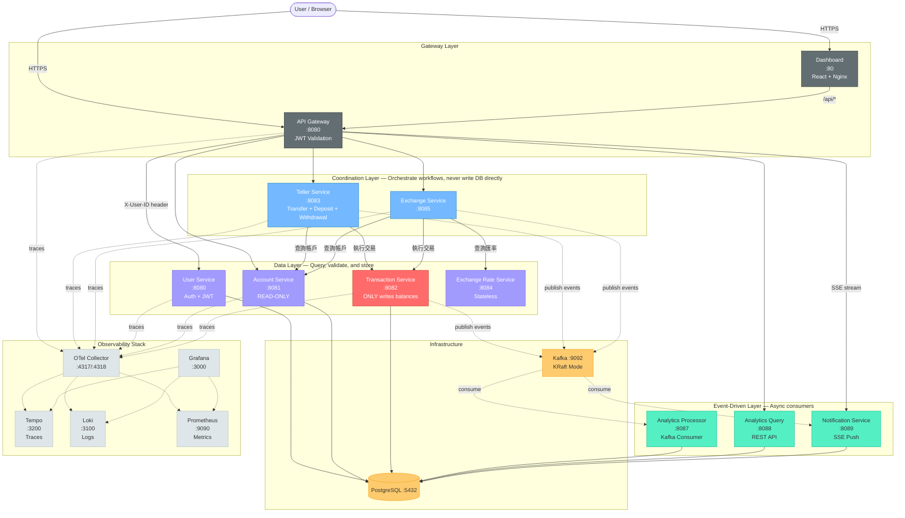
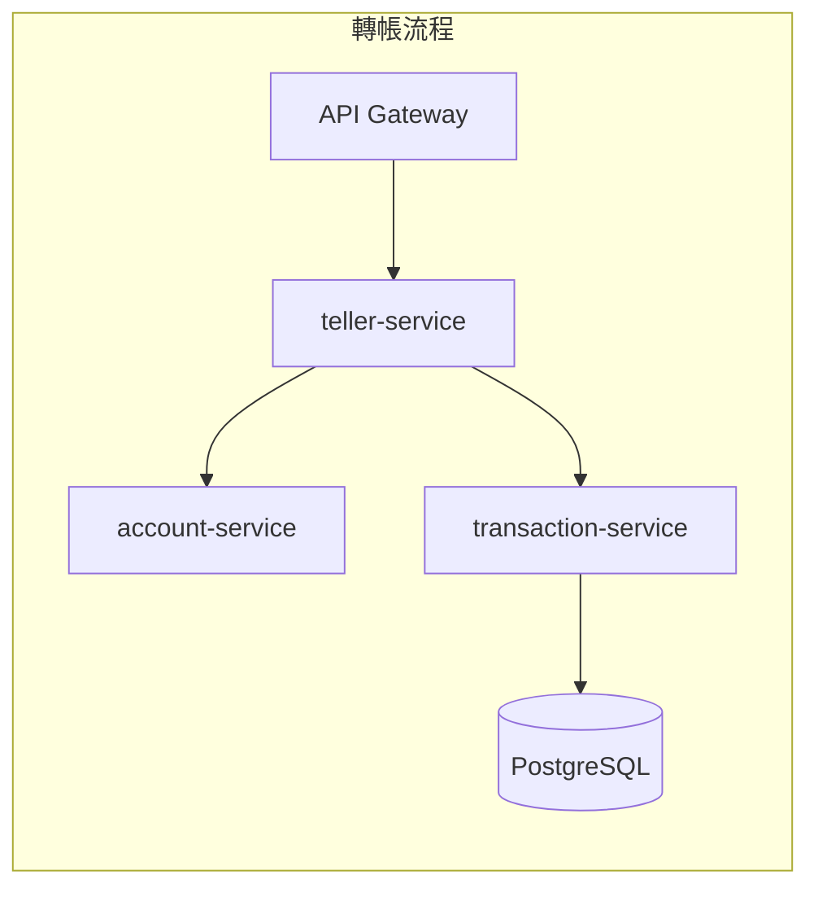
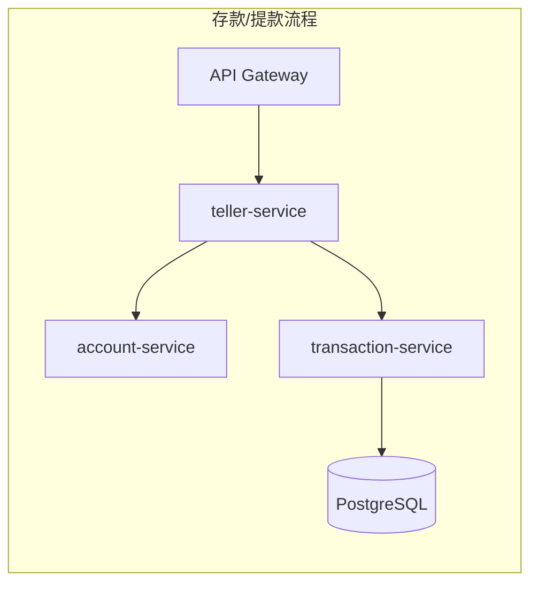
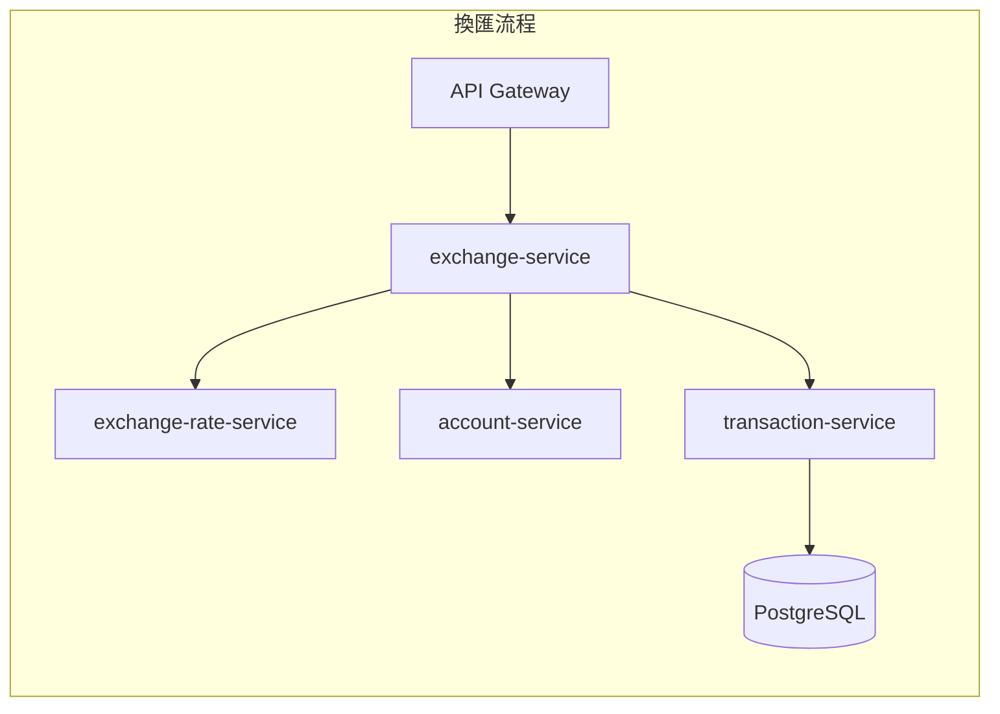
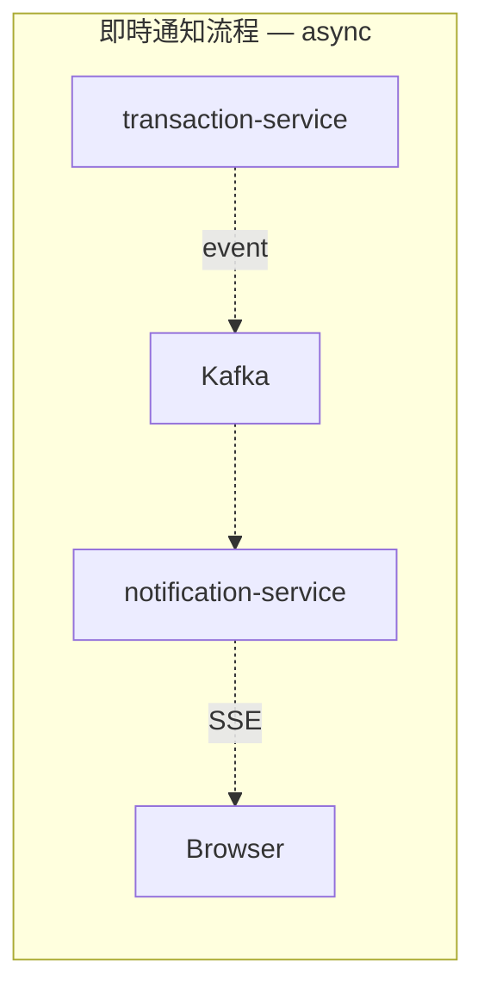

# LiteBank Architecture

## System Overview

LiteBank is a microservices banking system with 10 services (9 custom + API Gateway), demonstrating coordination layer architecture, pessimistic-lock-based distributed transactions, and full OpenTelemetry observability.

## Architecture Diagram

## Service Dependency Matrix

| Service | Type | Port | DB | Kafka | JWT | Calls (downstream) |
|---------|------|------|----|-------|-----|---------------------|
| api-gateway | Gateway | 8080 | - | - | Yes | Routes to all services |
| dashboard | Frontend | 80 | - | - | - | api-gateway |
| teller-service | Coordination | 8083 | - | Pub | - | account-service, transaction-service |
| exchange-service | Coordination | 8085 | - | Pub | - | account-service, transaction-service, exchange-rate-service |
| user-service | Data Layer | 8080 | Yes | - | Yes | - |
| account-service | Data Layer | 8081 | Yes | - | - | - |
| **transaction-service** | **Data Layer** | **8082** | **Yes** | **Pub** | - | - |
| exchange-rate-service | Data Layer | 8084 | - | - | - | - |
| analytics-processor | Event-Driven | 8087 | Yes | Sub | - | - |
| analytics-query | Event-Driven | 8088 | Yes | - | - | - |
| notification-service | Event-Driven | 8089 | Yes | Sub | - | - |

## Critical Paths

## Key Architectural Rules

1. **All balance modifications MUST go through Transaction Service.** Coordination services orchestrate by calling data layer services; they never write directly to the database.
2. **Coordination services are stateless.** They hold no database connections and only call downstream data layer services via HTTP.
3. **Event-driven services are eventually consistent.** Analytics and notifications consume Kafka events asynchronously; their failure does not affect core transaction flows.
4. **API Gateway is the single entry point.** JWT validation happens here; downstream services receive `X-User-ID` header.

## Failure Impact Analysis

| Component | Failure Impact | Blast Radius |
|-----------|---------------|--------------|
| **PostgreSQL** | All DB-dependent services fail (6 services) | Critical — full system |
| **transaction-service** | All write operations fail (teller, exchange) | Critical — all mutations |
| **API Gateway** | No external access to any service | Critical — full system (external) |
| **Kafka** | Event-driven services lose data flow; core transactions unaffected | High — analytics + notifications |
| **account-service** | All coordination services fail (cannot query accounts) | High — all business flows |
| **user-service** | No new logins; existing JWT tokens still work | Medium |
| **exchange-rate-service** | Only exchange flow fails | Low — isolated |
| **analytics-processor** | Analytics data stops updating | Low — no user impact |
| **notification-service** | No real-time push notifications | Low — no user impact |

## Infrastructure (Kubernetes)

- All services deployed as **Deployment** (replicas: 1)
- PostgreSQL and Kafka deployed as **StatefulSet** (replicas: 1)
- Gateway: Kubernetes Gateway API with Cilium
- All services expose health probes: `/actuator/health/readiness` and `/actuator/health/liveness`
- OpenTelemetry: Manual SDK instrumentation + W3C TraceContext propagation
